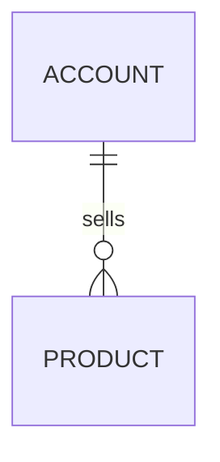

# Data model

Verified against commit `{{commit}}` ({{date}}). Paths are repo-relative.

## Renames

<!-- Models whose code name differs from the API or UI name. -->

| Code | API / UI | Id prefix |
|---|---|---|
| `<Model>` | <name> | `<prefix>` |

## Entity graph

## Core models

| Model | Id | Key relations | Notes |
|---|---|---|---|
| `<Model>` | `<prefix>` | <relations> | <one line> (`<path>:<line>`) |

## Rules that follow from the id system

1. <rule>

## Datastores

| Store | Holds | Code |
|---|---|---|
| <store> | <what> | `<path>` |
