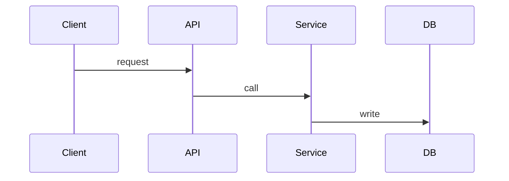

# Flows, traced hop by hop

Verified against commit `{{commit}}` ({{date}}). Paths are repo-relative.
Line numbers drift; search the symbol if a line doesn't match. Terms are in [glossary.md](glossary.md).

<!-- Pick the flows that move money, grant access, or lose data when they break. For each: the
entry point, every hop with a citation, the state each hop writes, and where it fails. -->

## 1. <Flow name>

1. **<Hop>:** <what happens> (`<path>:<line>`)

**Where it fails:** <list>
