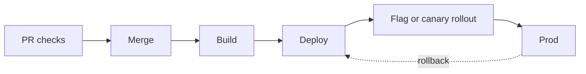

# Operations: shipping, scale and incidents

Verified against commit `{{commit}}` ({{date}}). Paths are repo-relative.
Every number needs a source and a date.

## Path to production

1. **Checks:** <what gates a merge> (`<workflow path>`)
2. **Deploy:** <how and where> (`<path>`)
3. **Rollout:** <flags, canaries, percentages> (`<path>`)
4. **Rollback:** <how, and how long it takes>
5. **Schema migrations:** <how they deploy relative to code>
6. **Mobile releases:** <release train, review, phased rollout>

## Environments

| Environment | Purpose | Data | How to reach |
|---|---|---|---|
| <env> | <purpose> | <data> | <how> |

## Scale and SLOs

| Measure | Value | Source and date | Live dashboard |
|---|---|---|---|
| <requests per second, jobs per day, data size, p99 latency, availability target> | <value> | <source> | <dashboard> |

## Recent serious incidents

| When | What broke | Root cause | What changed after | Postmortem |
|---|---|---|---|---|
| <date> | <impact> | <cause> | <change> | <link> |
