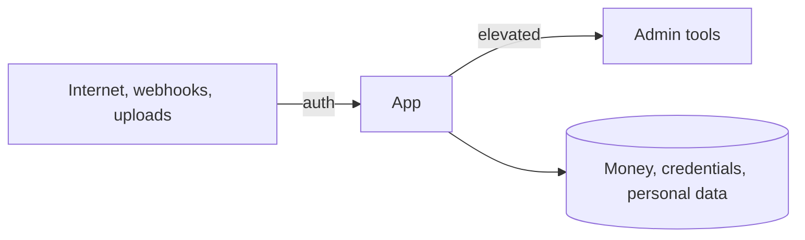

# Security and trust boundaries

Verified against commit `{{commit}}` ({{date}}). Paths are repo-relative.

## Trust boundaries

## Authentication and authorization

| Concern | How it works | Code |
|---|---|---|
| <user auth, API keys, service auth, permissions> | <one line> | `<path>` |

## Sensitive paths

| Path | Why sensitive | Guarded by |
|---|---|---|
| <money movement, credential storage, personal data, admin> | <reason> | `<path>` |

## Compliance scope as enforced in code

<!-- Only what the code enforces: a vault for card data, audit logs, data retention jobs. -->
