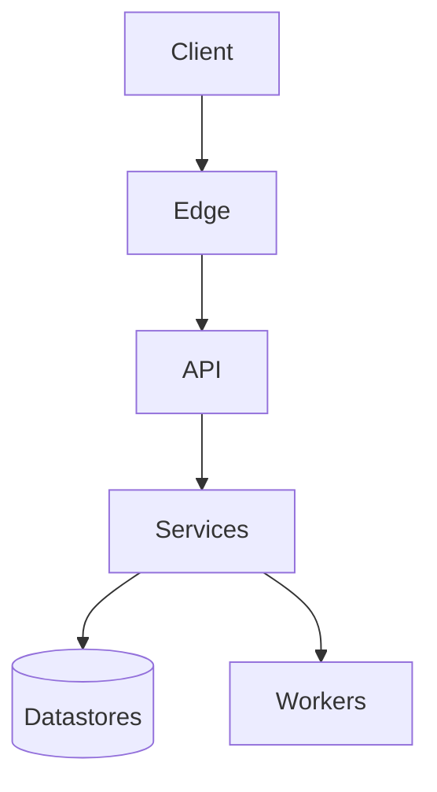

# System map and tech stack

Verified against commit `{{commit}}` ({{date}}). Paths are repo-relative.
Where a doc and the code disagree, the code wins; disagreements are listed in
[maintaining.md](../maintaining.md#known-stale-docs).

## The whole system

## Request entry points

| Entry | Served by | Code |
|---|---|---|
| <host or path> | <service> | `<path>` |

## Stack by area

| Area | Stack | Runs on | Agent doc |
|---|---|---|---|
| `<dir>/` | <language, framework> | <host> | `<dir>/README.md` |

## Other top-level directories

| Directory | What it is |
|---|---|
| `<dir>/` | <one line> |
