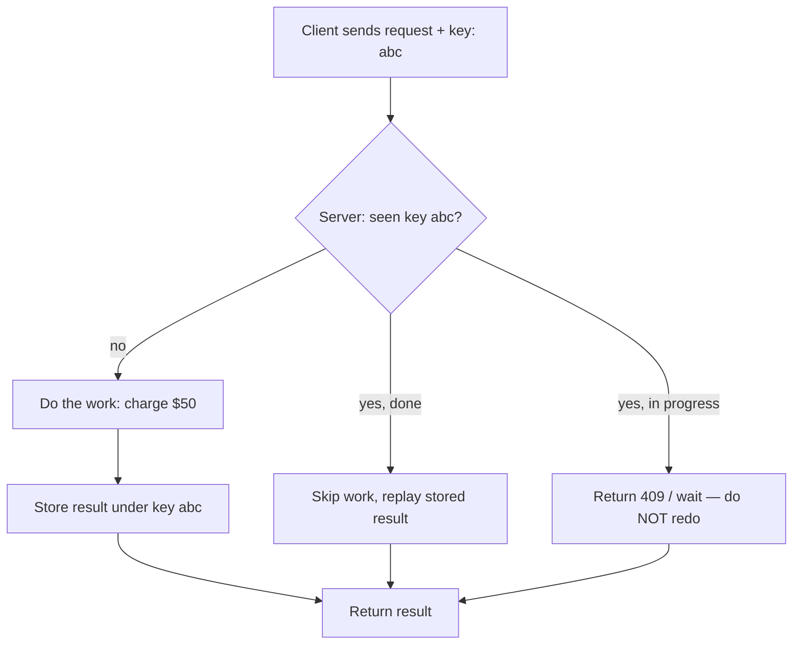

# /teach — Worked examples

Two complete Teaching Cards. Study the *shape*, not the topics: notice how the
one-liner leads, the analogy names its own seam, the example traces one object,
and the curveball defense leads worst-first.

---

# Example A — Idempotency keys (payments-flavored, technical)

## The one-liner
An idempotency key is a "you already asked me this" tag on a request, so if the
same request arrives twice, the server does the work once and replays the same
answer instead of charging the customer twice.

## The analogy
It's a coat-check ticket. You hand over your coat (the request), get a numbered
ticket (the key). Ask for "the coat for ticket 42" ten times and you get the same
one coat back, not ten coats. **Where the analogy breaks:** a coat check assumes
your coat already exists; an idempotency key has to handle the case where the very
first request is still *in progress* when the duplicate shows up. That in-flight
race is the hard part the coat check doesn't model.

## The picture


## How it actually works (one traced request)
1. Client wants to charge $50. It generates key `abc-123` and sends `POST /charge`
   with header `Idempotency-Key: abc-123`.
2. Network hiccups. Client never got a response, so it **retries** the exact same
   request — same key `abc-123`.
3. Server looks up `abc-123` in its idempotency store. First arrival: not found.
   It marks `abc-123` as *in progress*, charges the card once, stores
   `{status: 200, body: {charge_id: ch_9}}` under `abc-123`, and returns it.
4. The retry arrives. Server finds `abc-123` = done. It **skips the charge** and
   replays `{charge_id: ch_9}`. Customer charged once. Client sees success.

## The depth ladder
- **ELI5:** a sticker on your request that says "if you've seen this before, don't
  do it again — just tell me what happened last time."
- **Practitioner:** client generates a unique key per logical operation, sends it on
  retries; server stores (key → response) and returns the stored response on repeat.
  Scope the key to the operation, set a TTL, key must be client-generated and stable
  across retries.
- **Expert:** correctness hinges on the *in-progress* state and atomic
  check-and-set. Naive "check then write" has a race: two duplicates both read
  "not found" and both charge. You need an atomic insert (unique constraint / SETNX)
  so the second one loses and either waits or returns 409. TTL is a tradeoff: too
  short and a slow retry double-charges; too long and you store forever.

## Curveball defense
1. **(Boundary) "What if two duplicates arrive at the exact same millisecond,
   before the first finishes?"** — This is *the* question. A plain check-then-write
   double-charges here. You need an atomic reservation: insert the key with a unique
   constraint before doing the work; the loser of that insert gets 409/waits. If your
   store can't do atomic insert, idempotency is theater.
2. **(Why-not-X) "Why not just dedupe on the charge amount + card + timestamp?"** —
   Because legitimate identical charges exist (buy the same $5 coffee twice) and
   because timestamps drift on retries. A client-generated key encodes *intent*:
   "these are the same logical operation," which content-matching can't infer.
3. **(Misconception) "Idempotency means the operation has no side effects, right?"** —
   No. It means *repeating* it has no *additional* effect. The first call absolutely
   charges the card. That's different from a "safe" method like GET that never changes state.
4. **(Operator's caveat) "What actually bites you in prod?"** — Key reuse across
   *different* operations. If a client reuses `abc-123` for a $50 charge today and a
   $70 charge tomorrow, the server replays the old $50 result and silently drops the
   $70. Keys must be unique per operation, and you should store a request fingerprint
   to reject "same key, different body."
5. **(Second-order) "What if the first request succeeds but storing the result
   fails?"** — Now you've done the work with no record. The next retry re-does it →
   double charge. Fix: make the side effect and the key-store write atomic (same
   transaction), or make the downstream itself idempotent.
6. **(Adjacent confusion) "Idempotency vs. exactly-once delivery?"** — Idempotency
   is *at-least-once delivery made safe by the receiver.* You don't prevent
   duplicates on the wire; you make duplicates harmless on arrival. True exactly-once
   *delivery* is famously near-impossible in distributed systems; idempotency is the
   practical substitute.

## Check yourself
1. A retry arrives while the original is still processing. What must the server do,
   and what bug appears if it just does "check then write"?
2. Why isn't content-based deduplication (same amount + card) a safe substitute?
3. Does an idempotent charge endpoint have side effects? Explain.

<details><summary>Answers</summary>

1. Atomically reserve the key first (unique insert); the duplicate loses and waits
   or returns 409. Check-then-write races → both charge → double charge.
2. Legitimate identical operations exist and can't be told apart from retries; the
   key encodes intent, content can't.
3. Yes — the *first* call charges the card. Idempotency only means *repeats* add no
   further effect.
</details>

## The 60-second teach-back
"An idempotency key is a tag the client puts on a request so retries are safe. First
time the server sees the key, it does the work and stores the result under that key.
Every later request with the same key just gets the stored result replayed — no
second charge. The whole game is the in-progress race: if a duplicate lands before
the first finishes, a naive server double-charges, so you reserve the key atomically
before doing the work. It's at-least-once delivery made harmless by the receiver."

---

# Example B — Database indexes (general engineering)

## The one-liner
A database index is the book's index at the back: instead of reading every page to
find "photosynthesis," you look it up in the sorted list and jump straight to the
page — the DB does the same to avoid scanning every row.

## The analogy
The index at the back of a textbook. Sorted terms → page numbers. **Where it
breaks:** a book index is static and you maintain it by hand once; a DB index is
maintained *automatically on every insert/update/delete*, which is exactly why
indexes aren't free — that upkeep is the cost people forget.

## The picture
```
WITHOUT index: find user email = 'x'         WITH index (B-tree on email):
┌───────────────────────────┐                sorted tree, jump in ~log(n) hops
│ row 1  scan                │                        [m]
│ row 2  scan                │                       /   \
│ ...    scan  (all N rows)  │                     [d]   [t]
│ row N  scan                │                    / \    / \
└───────────────────────────┘                  ...  →  'x' found in ~3 hops
   O(N) — reads everything          O(log N) — reads a handful of nodes
```

## How it actually works (one traced query)
Table `users`, 10 million rows. Query: `SELECT * FROM users WHERE email = 'a@b.com'`.
1. **No index:** the DB does a *full table scan* — reads all 10M rows, compares each
   email, returns the match. ~10M reads.
2. **With a B-tree index on `email`:** emails are stored in a sorted, balanced tree.
   The DB starts at the root, compares `a@b.com`, walks left or right, and reaches the
   leaf in ~log₂(10M) ≈ 23 hops. The leaf holds a pointer to the actual row.
3. It follows that pointer to fetch the full row. ~24 reads total instead of 10M.
4. Now `INSERT` a new user: the DB must also insert that email into the sorted tree
   in the right spot — a little extra work on *every write*. That's the rent you pay
   for fast reads.

## The depth ladder
- **ELI5:** the sorted list at the back of a book so you don't read every page.
- **Practitioner:** create indexes on columns you filter/join/sort on frequently.
  Each index speeds matching reads and slows writes and costs disk. Composite index
  order matters: `(a, b)` helps `WHERE a=` and `WHERE a= AND b=`, not `WHERE b=` alone.
- **Expert:** most indexes are B-trees (balanced, O(log n), good for ranges and
  sorting). The leftmost-prefix rule governs composite usage. A *covering* index that
  contains all selected columns skips the row fetch entirely. The optimizer may ignore
  your index if it estimates the scan is cheaper (low selectivity — e.g. a boolean
  column that's 50/50). Hash indexes give O(1) equality but no ranges.

## Curveball defense
1. **(Why-not-X) "If indexes make reads fast, why not index every column?"** — Because
   every index is maintained on every write and consumes disk. Index-everything turns a
   fast write table into a slow one and bloats storage. You index for your read
   patterns, not reflexively. This is the read/write tradeoff — name it out loud.
2. **(Boundary) "When does an index NOT help — or hurt?"** — Low selectivity. An index
   on a boolean `is_active` that's 50% true is often *worse* than a scan, because you'd
   do index lookups for half the table plus row fetches; the optimizer will (correctly)
   ignore it. Indexes shine when the column narrows results a lot.
3. **(Misconception) "I put an index on `(last_name, first_name)`, so `WHERE
   first_name = 'Sam'` is fast, right?"** — No. Leftmost-prefix rule: a composite index
   is sorted by the first column first. It helps `WHERE last_name=` or `last_name= AND
   first_name=`, but not `first_name=` alone — that's still a scan.
4. **(Operator's caveat) "What surprises people in prod?"** — Write amplification and
   the optimizer's mind. Adding an index to fix one slow query can quietly slow every
   insert on a hot table. And the optimizer sometimes ignores a perfectly good index
   because its *statistics* are stale — `ANALYZE`/rebuild stats before you conclude the
   index is broken.
5. **(Second-order) "We added an index and the slow query got faster — done?"** — Watch
   the write path and replication. More indexes → slower bulk inserts, bigger WAL/binlog,
   more replication lag. The read win can create a write regression three dashboards over.
6. **(Adjacent confusion) "Index vs. primary key vs. partition?"** — A **primary key** is
   a uniqueness constraint that's usually *backed* by an index; an **index** is the lookup
   structure itself; **partitioning** splits the table into physical chunks so the DB skips
   whole chunks. They compose — you can partition and index within each partition.

## Check yourself
1. Why is indexing a 50/50 boolean column often useless?
2. You have an index on `(a, b)`. Which of these use it: `WHERE a=1`, `WHERE b=2`,
   `WHERE a=1 AND b=2`?
3. Name the core tradeoff of adding an index.

<details><summary>Answers</summary>

1. Low selectivity — it doesn't narrow results, so index-lookup + row-fetch costs more
   than a scan; the optimizer ignores it.
2. `WHERE a=1` ✅ and `WHERE a=1 AND b=2` ✅ (leftmost prefix). `WHERE b=2` ❌ alone.
3. Faster matching reads, in exchange for slower writes and more disk (upkeep on every
   insert/update/delete).
</details>

## The 60-second teach-back
"An index is the sorted list at the back of a book: instead of scanning all 10 million
rows to find one email, the DB walks a balanced tree in about 20 hops. It's not free —
the tree is maintained on every write, so indexes trade faster reads for slower writes
and more disk. So you index the columns you actually filter and join on, not everything.
Two gotchas: low-selectivity columns (like a 50/50 boolean) don't benefit, and composite
indexes only work left-to-right, so `(last, first)` won't speed up a search on `first`
alone."
